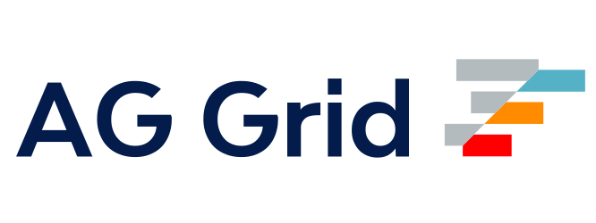
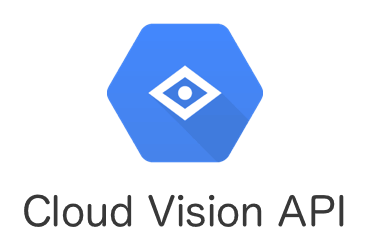
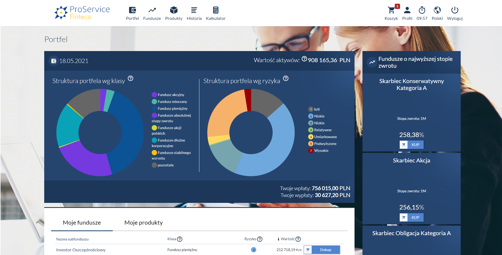
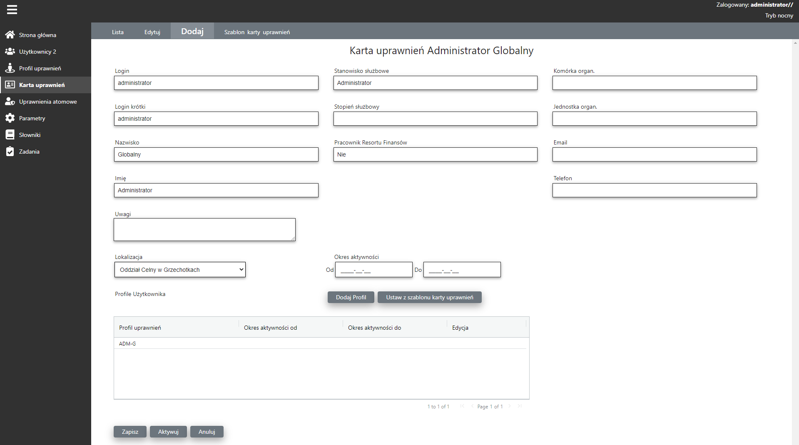
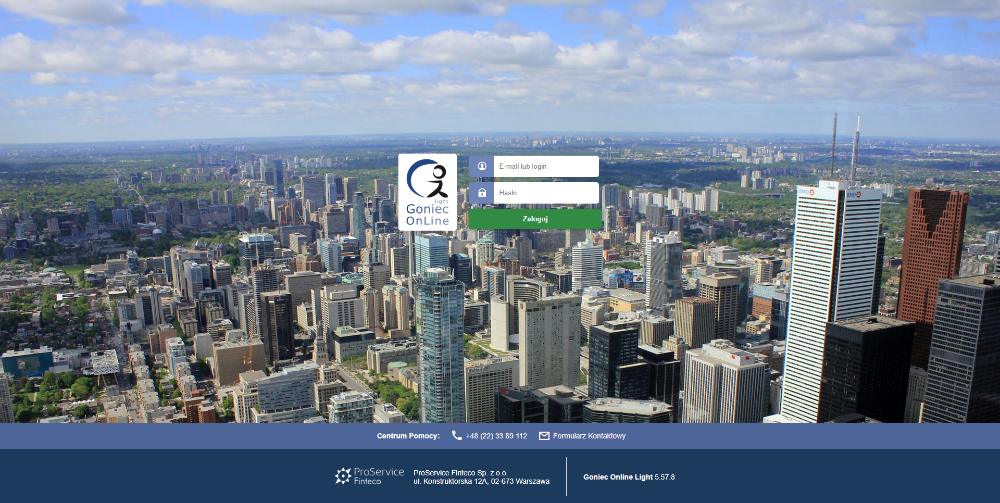

| Frameworks               |                          |
|--------------------------|--------------------------| 
| Angular v18              | ⭐ ⭐ ⭐ ⭐ ⭐                |
| NgRx                     | ⭐ ⭐ ⭐                    |
| NestJS                   | ⭐                        | 

|Library                   |                          |
|--------------------------|--------------------------| 
| RxJS                     | ⭐ ⭐ ⭐ ⭐ ⭐                |
| Bootstrap                | ⭐ ⭐ ⭐ ⭐ ⭐                | 
| Angular Material         | ⭐ ⭐ ⭐ ⭐                  | 
| AG Grid                  | ⭐ ⭐ ⭐ ⭐                  | 
| PrimeNG                  | ⭐ ⭐ ⭐ ⭐                  | 
| Tailwind CSS             | ⭐ ⭐ ⭐                    | 
| SignalR                  | ⭐ ⭐ ⭐                    | 
| StoryBook                | ⭐ ⭐ ⭐                    |

|Languages                 |	           	          |
|--------------------------|--------------------------| 
|  HTML 5                  | ⭐ ⭐ ⭐ ⭐ ⭐                |
| CSS3                     | ⭐ ⭐ ⭐                    |
| JavaScript               | ⭐ ⭐ ⭐ ⭐                  |
| TypeScript               | ⭐ ⭐ ⭐ ⭐                  |
| T-SQL                    | ⭐ ⭐ ⭐                    |

|AI and Machine Learning   |		                  |
|--------------------------|--------------------------| 
|  Cloud Vision API        | ⭐ ⭐ ⭐                    |
 
 
<!--
<h3 align="left">Frameworks:</h3>

 
  

<h3 align="left">Library:</h3>   

<h3 align="left">Languages:</h3>  

 
 
 
 
  

<h3 align="left">Tools:</h3>  
 

<h3 align="left">AI and Machine Learning:</h3>

 --> 

<h1 align="center">Commercial projects</h1> 
<table>
	<tr> 
		<td width="50%" valign="top">
			<h3 align="center">STI24</h3>
			
<strong>The STI24 system provides support for PSO, PPE, IKE, IKZE, PPK products. </strong>

		 
		 

		 <strong> Technologies used </strong>
		  
		 
		 
		 
		 
		 
		 
		 
		 

		</td>
		<td width="50%" valign="top">
			<h3 align="center">Administration Panel for the Digital Frontier system</h3>
		
<strong>Provides administration of the Digital Frontier system. 
		 The main functions are the administration of users, 
		 permissions,cards, tasks, etc.</strong>

		 
		 

		 <strong> Technologies used </strong>
		  
		 
		 
		 
		 
		 
		 
		
 
		</td>		
	</tr>
	<tr>
		<td width="50%" valign="top" style="background-color: white;">
		<h3 align="center">Goniec OnLine light</h3>
		
<strong>Goniec OnLine light is an application that enables customer service by the distributor. The application has functions for selling products, including such as IKE, IKZE, PSO.</strong>

		
		

		<strong> Technologies used </strong>
		 
		
		
		
		
		
		
		

		</td>
	</tr>
</table>
  
 
